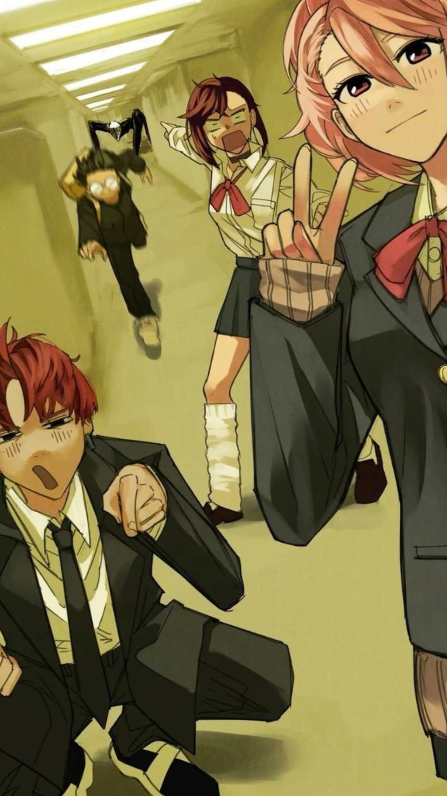

# Tomás Menke 
Hola!, soy estudiante de tercer año de ingeniería biológica. Me encanta aprender y crear cosas. Actualmente me gustaría investigar la dinámica de interferencia viral en sistemas bacteria-bacteriófago, con un enfoque en el rol de las partículas interferentes defectuosas. Pero no sé mucho al respecto, me queda mucho por estudiar sobre el tema para poder presentarselo ah algún profesor interesado. 
## Algunos de mis pasatiempos son:
- Hacer trekking
- Manualidades
- Leer
- Deporte

Quiero aprender hartas cosas en este ramo, permitiendome crear proyectos interesantes desde mi casa en colaboración con otras personas del otro lado del mundo.

